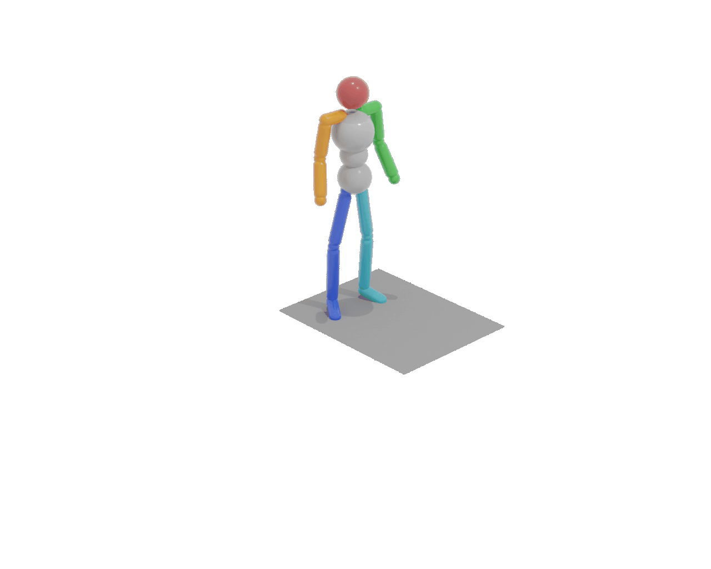
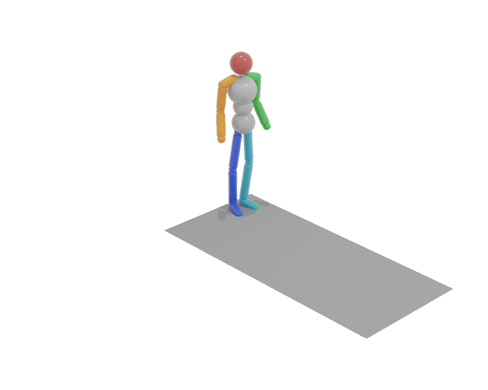
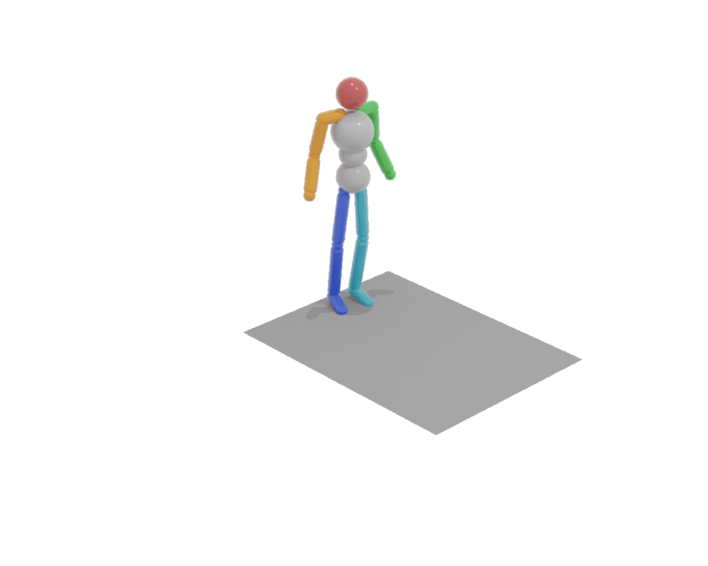
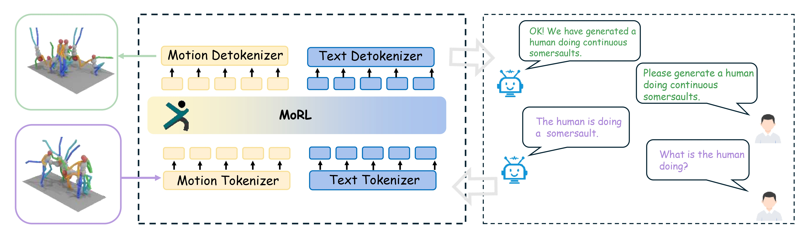
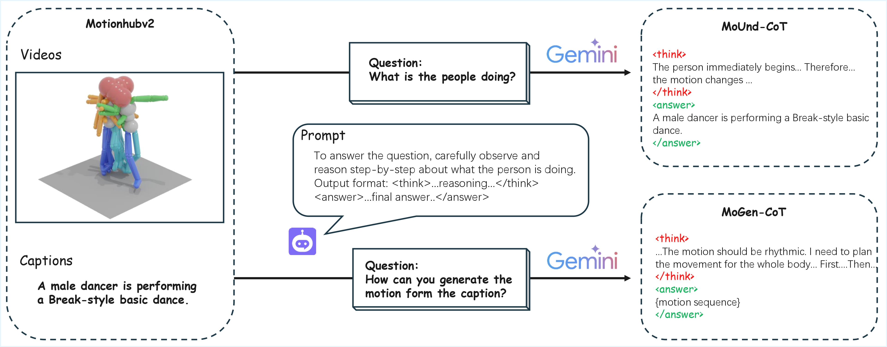

# MoRL: Reinforced Reasoning for Unified Motion Understanding and Generation
>
> Hongpeng Wang*, Zeyu Zhang*<sup>†</sup>, Wenhao Li, Hao Tang<sup>‡</sup>
>
> *Equal contribution. <sup>†</sup>Project lead. <sup>‡</sup>Corresponding author.
>
> ### [Paper](https://arxiv.org/abs/2602.14534) | [Code](https://github.com/AIGeeksGroup/MoRL) | [Website](https://aigeeksgroup.github.io/MoRL) | [Data](https://huggingface.co/datasets/AIGeeksGroup/MoUnd-MoGen-CoT-140K)


## Qualitative Videos

<table>
  <tr>
    <td align="center"></td>
    <td align="center"></td>
    <td align="center"></td>
    <td align="center"></td>
  </tr>
  <tr>
    <td align="center"></td>
    <td align="center"></td>
    <td align="center"></td>
    <td align="center"></td>
  </tr>
</table>


## Intro

MoRL is a unified multimodal motion model designed to advance both human motion understanding and generation. Unlike prior approaches that treat user queries as a whole and lack explicit reasoning or planning, MoRL leverages a hierarchical post-training pipeline combining supervised fine-tuning (SFT) and reinforcement learning with verifiable rewards (RLVR). Our task-specific reward design is dual-headed: for motion understanding, we introduce semantic alignment and a novel reasoning coherence reward to enforce logically consistent reasoning traces; for motion generation, we combine text–motion consistency with a physical plausibility reward to ensure biomechanical validity and perceptual realism. To further enhance inference, we propose Chain-of-Motion (CoM), a test-time reasoning strategy that enables step-by-step planning and reflection. CoM improves both the robustness of reasoning-based motion understanding and the quality of motion generation through iterative selection and correction. This principle also guides the construction of two large-scale synthetic Chain-of-Thinking (CoT) datasets: MoUnd-CoT-140K and MoGen-CoT-140K, which align motion sequences with reasoning traces and concise action descriptions. Extensive experiments on HumanML3D and KIT-ML demonstrate that MoRL achieves significant gains over state-of-the-art baselines in both logical reasoning and perceptual realism. Our code, data, and models are open-sourced to facilitate further research in unified motion-language modeling.

<p align="center">
  
</p>

<b>Overview of MoRL.</b> MoRL unifies motion understanding and generation under a reinforcement learning paradigm. Motion and text inputs are tokenized into a shared representation space. A hierarchical post-training pipeline first applies SFT on large-scale synthetic CoT datasets to align motion sequences with reasoning traces and concise descriptions, then employs RLVR to refine outputs, enhancing semantic alignment, reasoning coherence, physical plausibility, and text–motion consistency. At inference, the Chain-of-Motion (CoM) decoding strategy enables step-by-step reasoning and reflection, improving both motion understanding and perceptually realistic motion generation.

<p align="center">
  
</p>
<b>Motion CoT data engine.</b> Built on MotionHubV2, one branch (MoUnd-CoT-140K) uses motion sequences and captions with Gemini to construct reasoning chains for understanding, while the other (MoGen-CoT-140K) builds reasoning chains for generation.

[//]: # (## News)

[//]: # ()
[//]: # (- **2026/03/24**: Repository README updated for MoRL reproduction workflow.)

[//]: # (- More updates &#40;datasets/checkpoints/scripts&#41; will be added soon.)

## TODO List

- [x] Upload our paper to arXiv and build project pages.
- [x] Upload the code.
- [x] Release curated MoUnd-CoT / MoGen-CoT data. (see [MoUnd-MoGen-CoT-140K](https://huggingface.co/datasets/AIGeeksGroup/MoUnd-MoGen-CoT-140K))
- [x] Release training checkpoints.

## Quick Start

### Environment Setup

Install dependencies:

```bash
pip install -r requirements.txt
```

### Prepare Basic Resources

This repo provides helper scripts under `prepare/`:
- `prepare/download_extractor.sh`
- `prepare/download_glove.sh`

Run with bash:

```bash
bash prepare/download_extractor.sh
bash prepare/download_ckpt.sh
```

If you are on native Windows PowerShell, you can manually download and unzip these assets following the URLs in the scripts.

## Data Preparation


### Download and Prepare Motion Datasets

You can download the pre-processed motion datasets from our [HuggingFace page](https://huggingface.co/datasets/AIGeeksGroup/MoUnd-MoGen-CoT-140K).
For custom data or full AMASS/kitml/HumanML3D, please follow the instructions in `dataset/` and `prepare/` folders.


## Training

### A) SFT Stage

#### SFT for t2m

```bash
python train_mllm.py \
  --train-stage sft \
  --training-task t2m \
  --cot-train-jsonl path/to/cot_train.jsonl \
  --use-reasoning \
  --exp-name morl_sft_t2m
```

#### SFT for m2t

```bash
python train_mllm.py \
  --train-stage sft \
  --training-task m2t \
  --cot-train-jsonl path/to/cot_train.jsonl \
  --cot-task-filter m2t \
  --use-reasoning \
  --exp-name morl_sft_m2t
```

### B) RLVR Stage (GRPO)

```bash
python train_mllm.py \
  --train-stage rlvr \
  --training-task t2m \
  --cot-train-jsonl path/to/cot_train.jsonl \
  --rl-reference-ckpt experiments/morl_sft_t2m/motionllm_t2m_best.pth \
  --rl-epochs 3 \
  --rl-group-size 8 \
  --exp-name morl_rlvr_t2m
```

For m2t RLVR, set `--training-task m2t` and optionally `--cot-task-filter m2t`.

## Evaluation / Inference

### Evaluate t2m

```bash
python eval_mllm.py \
  --eval-task t2m \
  --eval-ckpt experiments/morl_rlvr_t2m/motionllm_rlvr_epoch_2.pth
```

### Evaluate m2t

```bash
python eval_mllm.py \
  --eval-task m2t \
  --eval-ckpt experiments/morl_rlvr_m2t/motionllm_rlvr_epoch_2.pth
```

### Enable CoM decoding

```bash
python eval_mllm.py \
  --eval-task t2m \
  --eval-ckpt experiments/morl_rlvr_t2m/motionllm_rlvr_epoch_2.pth \
  --use-com \
  --com-candidates 8 \
  --com-refine-steps 2
```

## Citation

If you find this project useful, please consider citing:

```bibtex
@article{wang2026morl,
  title={MoRL: Reinforced Reasoning for Unified Motion Understanding and Generation},
  author={Wang, Hongpeng and Zhang, Zeyu and Li, Wenhao and Tang, Hao},
  journal={arXiv preprint arXiv:2602.14534},
  year={2026}
}
```

## Acknowledgement

We thank the open-source communities behind Motion-Agent, MotionGPT, Qwen, and related motion-language benchmarks for their foundational contributions.
